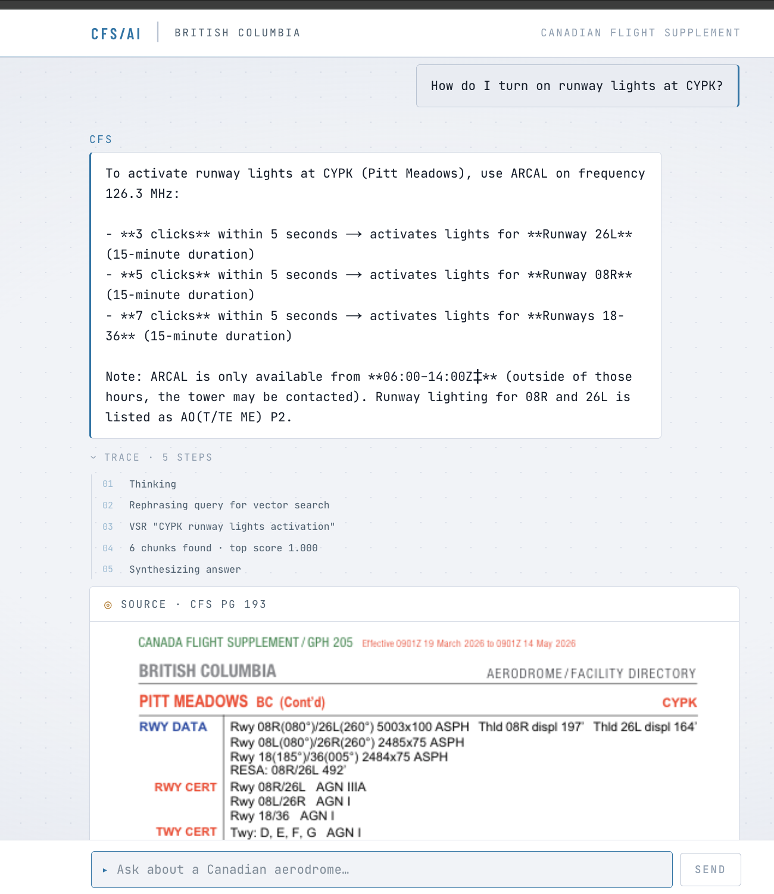

# CFS British Columbia Assistant

An AI-powered Q&A tool for Canadian pilots. Ask questions about aerodromes, circuit altitudes, radio frequencies, runway data, fuel availability, and more — all grounded in the NavCanada Canadian Flight Supplement (CFS).

> **Note:** The CFS PDF is not included in this repo. NavCanada retains copyright over the CFS, so you must obtain your own copy and place it at `public/CFS.pdf`. For the same reason, this app cannot be deployed publicly.



## How it works

The app is an agentic RAG pipeline. Every question is validated, then routed through vector search first — with Claude rephrasing queries for better retrieval — and escalated to vision only when the vector results are insufficient.

```
User question
      │
      ▼
 Evaluator (Claude — structured output)
 ├── No ICAO code?       ──► infer from name, or ask pilot to clarify
 ├── Multiple aerodromes?──► extract all ICAO codes, synthesize multi-part question
 ├── Ambiguous airport?  ──► ask pilot to pick (e.g. Victoria → CYYJ or CYWH)
 ├── Outside BC?         ──► out_of_scope
 ├── Off-topic?          ──► out_of_scope
 └── Ready?              ──► synthesize clean question with resolved ICAO
      │
      ▼
 Query rephrasing (Claude)
 └── Two queries per ICAO: aerodrome name + topic, and ICAO code + topic
      │
      ▼
 Vector search (LanceDB + jina-embeddings-v4) ×2 in parallel
 └── Pure ANN — normalized vectors, cosine similarity via L2
      │
      ▼
 Decision (Claude)
 ├── Results explicitly answer the question? ──► answer from chunks
 ├── Results insufficient or ambiguous?      ──► escalate to vision
 └── Pilot repeating or doubting?            ──► escalate to vision
      │
      ▼ (when needed)
 Vision pipeline
 ├── pdftotext → find aerodrome pages by term
 ├── pdftoppm → render pages to PNG
 └── Claude reads images → ground-truth answer
      │
      ▼
 Answer + source pages rendered inline (PDF.js)
```

**Evaluator** — the first stage in the pipeline. Resolves or infers all ICAO codes (supports multi-aerodrome questions), rejects out-of-scope questions (non-BC aerodromes, weather, NOTAMs), and loops with clarifying questions until the request is unambiguous. Hands off a synthesized, self-contained question downstream.

**Decision** — runs after vector search with the retrieved chunks and conversation history. Answers directly if results are sufficient, or escalates to vision if confidence is low, the field label doesn't match, or the pilot is repeating/doubting a previous answer.

**No API key required** — the app uses Claude Code's existing keychain OAuth session. The Anthropic API key is explicitly stripped from child process environments to prevent it overriding keychain auth. Requires `claude` to be on `PATH`.

## Tech stack

| Layer                  | Tool                                                                    |
| ---------------------- | ----------------------------------------------------------------------- |
| Web framework          | Next.js 16 (App Router)                                                 |
| UI                     | React + Tailwind CSS                                                    |
| Embedding model        | `jina-embeddings-v4` (Jina cloud API — index + runtime query embedding) |
| PDF parser             | LlamaParse cloud API                                                    |
| Vector database        | LanceDB                                                                 |
| Language model         | Claude Sonnet (via Claude Code CLI — keychain auth)                     |
| PDF text search        | `pdftotext` (poppler)                                                   |
| PDF rendering — server | `pdftoppm` (poppler)                                                    |
| PDF rendering — client | PDF.js                                                                  |

## Project structure

```
cfs_ai/
├── public/
│   ├── CFS.pdf                         # Source document
│   └── pdf.worker.mjs                  # PDF.js worker
├── scripts/
│   ├── build/
│   │   ├── llamaParse.mjs              # CFS.pdf → data/parsed_llama.md (LlamaParse cloud)
│   │   ├── preprocess.py               # parsed_llama.md → parsed_llama_preprocessed.md
│   │   ├── chunkEmbed.py               # preprocessed.md → data/embeddings.json (Jina v4 API, title-prefixed chunks)
│   │   ├── buildIndex.py               # embeddings.json → data/lancedb/
│   │   └── liteParse.mjs               # Alternative: CFS.pdf → data/parsed.json
│   ├── runtime/
│   │   └── cfsVectorSearch.mjs         # Vector search CLI (spawned per request)
│   └── eval/
│       ├── eval.ts                     # LLM-as-judge eval runner
│       └── evalCases.ts                # Golden Q&A test cases
├── data/
│   ├── parsed_llama.md                 # Raw LlamaParse output
│   ├── parsed_llama_preprocessed.md    # Cleaned markdown (boilerplate stripped)
│   ├── embeddings.json                 # 6649 chunk embeddings from Jina API (2048-dim)
│   └── lancedb/                        # Vector index
└── src/
    ├── lib/
    │   ├── types.ts                    # Shared types (Turn, TraceEvent, etc.)
    │   ├── agentTools.ts               # Query rewriting, ICAO extraction, chunk formatting
    │   ├── vectorSearch.ts             # LanceDB search subprocess wrapper
    │   ├── visionSearch.ts             # PDF vision pipeline
    │   ├── promptEvaluator.ts          # Question evaluator (ICAO inference, scope check)
    │   └── agentLoop.ts                # Agent orchestration
    └── app/
        ├── api/chat/route.ts           # Streaming NDJSON endpoint
        ├── hooks/
        │   └── useAgentStream.ts       # Client-side stream consumer
        ├── components/
        │   ├── agentTrace.tsx          # Collapsible agent trace panel
        │   └── pdfPageViewer.tsx       # PDF page renderer
        └── page.tsx                    # Chat UI
```

## Setup

1. Install dependencies:

    ```bash
    npm install
    uv sync
    ```

    `npm install` handles JS dependencies. `uv sync` creates a `.venv/` and installs Python dependencies from `pyproject.toml`. Install `uv` first if needed: `curl -LsSf https://astral.sh/uv/install.sh | sh`

2. Log in to Claude Code (required — the app uses keychain auth, not an API key):

    ```bash
    claude login
    ```

3. Install poppler (required for `pdftotext` and `pdftoppm`):

    ```bash
    brew install poppler
    ```

4. Set API keys in `.env.local`:

    ```
    LLAMA_CLOUD_API_KEY=<your key>
    JINA_API_KEY=<your key>
    ```

    `JINA_API_KEY` is used both at index-build time and at runtime — `cfsVectorSearch.mjs` calls the Jina API to embed each query.

5. Obtain a copy of the CFS PDF from NavCanada and place it at `public/CFS.pdf`. Then generate the vector index:

    ```bash
    LLAMA_CLOUD_API_KEY=... node scripts/build/llamaParse.mjs
    uv run python scripts/build/preprocess.py
    JINA_API_KEY=... uv run python scripts/build/chunkEmbed.py
    uv run python scripts/build/buildIndex.py
    ```

6. Start the dev server:
    ```bash
    npm run dev
    ```

The app will be available at `http://localhost:3000`.

## Evals

The eval suite runs 14 golden Q&A cases through the full agent pipeline and uses Claude as a judge to verify answer quality. Cases cover tower vs. MF frequency labeling, fuel availability, circuit altitudes, hallucination guards, and evaluator behaviour (ICAO inference, ambiguous names, out-of-scope requests).

```bash
npm run eval                          # run all cases
npm run eval -- --filter=regression   # run a tagged subset
npm run eval -- --timeout=120000      # override per-case timeout (ms)
```

Exit code 0 = all pass, 1 = any failures.

## Usage tips

- **Ask in plain English** — you don't need to know the ICAO code. "What's the circuit altitude at Pitt Meadows?" works just as well as `CYPK`. The evaluator infers the code or asks if it's ambiguous.
- **Ask specific questions** — circuit altitude, tower frequency, fuel types, runway dimensions, lighting.
- **Vision fallback is automatic** — the agent escalates to reading the actual PDF when it isn't confident in the vector results, or when you express doubt or ask to verify a previous answer.
- **Dark mode** — toggle in the top-right corner. Preference is saved to localStorage.
- The agent trace (collapsed below each answer) shows exactly which tools ran and what confidence scores were returned.
